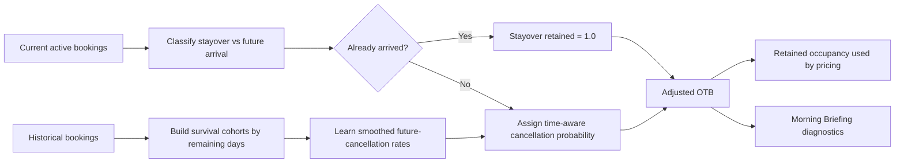

# Cancellation Logic Summary

## 1. Executive Summary

This project uses a transparent cancellation-adjusted occupancy layer so the hotel does not treat every booked room as equally reliable.

The current implementation is intentionally **interpretable rather than black-box**:

- historical bookings are used to estimate cancellation risk,
- active future bookings are converted into **likely retained rooms**,
- already-arrived stayovers are treated separately from future arrivals,
- pricing still remains deterministic; cancellation logic only improves the demand input used by the optimizer.

The current version is best described as:

> **Time-aware conditional cancellation risk for retained on-the-books demand**

or, more plainly:

> **A rule-based estimate of how many currently booked rooms are still likely to remain from today forward**

---

## 2. Why Cancellation Adjustment Was Needed

Using raw on-the-books occupancy alone can overstate true demand because hotels face meaningful cancellation risk.

The first version of the project corrected that by assigning each active booking a cancellation probability and converting raw OTB into:

- **Adjusted OTB** = expected retained rooms after cancellation risk
- **Expected Cancellations** = rooms likely to fall out before stay date

That was directionally right, but it had one important weakness:

> it estimated whether a booking would ever cancel, not whether it could still cancel from the current date onward.

That distinction matters sharply near arrival.

---

## 3. What Was Wrong With the Earlier Version

The earlier version used the booking's original lead-time profile, but did not account for how close the guest now was to arrival.

That meant:

- a booking created 60 days out could still carry a large cancellation probability one day before check-in,
- already-arrived guests staying over into future nights could still be treated as cancellable,
- next-day retained-room estimates could look unrealistically low.

### Concrete example before the fix

For the demo snapshot dated `2017-08-31`, the next stay date `2017-09-01` previously showed:

| Metric | Earlier behavior |
| --- | ---: |
| Booked rooms | 237 |
| Likely retained rooms | 152.77 |
| Expected cancellations | 84.23 |

That was not a believable next-day view, especially because many of those room nights were already-arrived stayovers.

---

## 4. Current v2 Logic

The revised model estimates:

> **Given that this booking is still active today, what is the probability that it cancels between now and arrival?**

### 4.1 Booking states are separated

The system now distinguishes:

- **Stayover room nights**: the guest has already arrived by the as-of date
- **Future-arrival room nights**: the guest has not yet arrived and can still cancel

Stayovers are treated as effectively retained for this PoC:

```text
If arrival_date <= as_of_date:
    cancellation_probability = 0
```

### 4.2 Remaining days to arrival is now explicit

Each future arrival is assigned to a **remaining-days band**:

```text
arrived
0-1 days
2-3 days
4-7 days
8-14 days
15-30 days
31+ days
```

This makes the model time-aware in the way hotel behavior naturally is:

- risk should generally be lower close to arrival,
- risk should be higher when more time remains for the guest to cancel.

### 4.3 Historical learning is conditional, not unconditional

For each historical booking, the model asks:

> Was this booking still active at a comparable point before arrival, and if so, did it cancel afterward?

That creates survival-style historical cohorts for each remaining-days band.

The estimator then learns smoothed cancellation rates using:

- remaining-days band
- original lead-time band
- market segment
- distribution channel
- customer type

### 4.4 Fallback remains interpretable

If a very specific combination has too little support, the system falls back gradually:

1. detailed bucket with all dimensions,
2. broader bucket with fewer dimensions,
3. remaining-days-band hotel-wide rate,
4. global hotel-wide rate if needed.

This preserves stability while keeping the logic inspectable.

---

## 5. End-to-End Flow



---

## 6. Core Formulas

### 6.1 Booking-level retained room expectation

For a future-arrival booking:

```text
Expected retained rooms = 1 - cancellation_probability
```

For an already-arrived stayover:

```text
Expected retained rooms = 1
```

### 6.2 Stay-date retained demand

```text
Adjusted OTB =
stayover rooms
+ sum(expected retained rooms for future arrivals)
```

### 6.3 Expected cancellations

In the published artifact layer:

```text
Expected Cancellations =
Live OTB - Adjusted OTB
```

The display remains capped at hotel capacity, so overbooked gross inventory does not make the manager-facing view exceed `237/237`.

---

## 7. What Changed in the Demo After v2

For `2017-09-01`, after the update:

| Metric | Current v2 behavior |
| --- | ---: |
| Booked rooms | 237 |
| Stayover rooms | 122 |
| Future-arrival rooms | 115 |
| Likely retained rooms | 237.00 |
| Expected cancellations | 0.00 |

Interpretation:

> The system now recognizes that the next-day book is largely made up of already-arrived or very-near-arrival demand, so it no longer removes a large artificial block of rooms as expected cancellations.

For later dates, cancellation risk remains active where it is still operationally plausible.  
For example, the refreshed demo artifacts show:

| Date | Booked | Stayovers | Future arrivals | Likely retained | Expected cancellations |
| --- | ---: | ---: | ---: | ---: | ---: |
| 2017-09-01 | 237 | 122 | 115 | 237.00 | 0.00 |
| 2017-09-02 | 236 | 88 | 148 | 232.26 | 3.74 |
| 2017-09-03 | 237 | 37 | 200 | 235.46 | 1.54 |

---

## 8. Where This Logic Appears in the Product

### 8.1 Pricing flow

Cancellation-adjusted occupancy affects pricing indirectly:

- the optimizer still compares **forecast occupancy** with **adjusted OTB occupancy**,
- the larger of the two becomes the demand basis for pricing,
- raw OTB remains visible so sold-out semantics are not lost.

So:

```text
Pricing occupancy = max(forecast occupancy, adjusted OTB occupancy)
```

Important:

> **Expected cancellations themselves do not directly set ADR.**  
> They change retained occupancy, and retained occupancy is what influences the optimizer.

### 8.2 Morning Briefing

The Morning Briefing now keeps the same main trend lines:

- Booked Rooms
- Likely Retained Rooms
- Forecast Rooms

but adds manager-facing clarity through:

- stayover-room counts,
- future-arrival-room counts,
- hover/detail text that explains cancellation risk only applies to not-yet-arrived bookings.

---

## 9. What Is Learned vs Heuristic

### Data-driven

- conditional future-cancellation rates from historical bookings,
- time-to-arrival sensitivity,
- segment/channel/customer-type differentiation,
- fallback behavior based on available support.

### Heuristic / policy choices

- remaining-days band definitions,
- zero-risk treatment for in-house stayovers,
- minimum-support threshold,
- smoothing strength,
- capacity-capped reporting semantics.

The system is therefore still transparent and inspectable, but materially more realistic than the first version.

---

## 10. Why This Matters for Revenue Management

This change improves several RMS behaviors at once:

1. **Better scarcity interpretation**  
   Next-day demand no longer looks artificially weak when the hotel is effectively full.

2. **More realistic cancellation planning**  
   Risk is concentrated where guests still have time to cancel.

3. **Cleaner explanations**  
   Managers can see whether the book is made of fragile future arrivals or already-secured stayovers.

4. **Safer pricing inputs**  
   The optimizer receives a more faithful estimate of retained demand without becoming a black box.

---

## 11. Current Limitations

### 11.1 Banding is still coarse

The model is more realistic than before, but remaining-days bands are still manually chosen buckets rather than a continuous hazard model.

### 11.2 No booking-level survival model yet

This is a transparent survival-style estimator, not a fully learned survival model with time-varying hazards.

### 11.3 Same-day operational nuance is simplified

At date granularity, the system treats already-arrived stayovers as retained.  
A production RMS might separately model:

- no-shows,
- same-day cancellations before check-in,
- early departures,
- no-show conversion by channel/segment.

### 11.4 Data quality still matters

The method assumes booking date, arrival date, cancellation date, and reservation status are reliable enough to reconstruct historical survival cohorts.

---

## 12. Validation Completed

The implementation was validated with:

- new unit tests for time-decay behavior,
- tests proving stayovers receive zero cancellation probability,
- snapshot tests for the stayover/future-arrival split,
- Morning Briefing checks for updated explanatory text,
- full repository unit-suite validation.

Current validation result:

```text
59 tests passed
```

---

## 13. Suggested Slide Storyline

### Slide 1 — The business problem

> Raw bookings overstate demand when some reservations are still likely to cancel.

### Slide 2 — The modeling mistake we corrected

> “Will this booking ever cancel?” is not the same as “Can this booking still cancel from today forward?”

### Slide 3 — The v2 design

- classify stayovers vs future arrivals,
- learn remaining cancellation risk by days-to-arrival,
- preserve transparent fallback logic.

### Slide 4 — Before vs after

Use the `2017-09-01` example:

- before: 237 booked, 152.77 retained
- after: 237 booked, 237 retained

### Slide 5 — Why it improves RMS quality

- better occupancy semantics,
- better manager trust,
- better pricing inputs,
- still explainable.

---

## 14. Talking Points for a Lead Data Scientist

### 30-second version

> We upgraded cancellation handling from an unconditional booking-level cancellation rate to a conditional remaining-risk model. The system now distinguishes already-arrived stayovers from future arrivals, learns risk by days remaining to arrival, and uses that to estimate retained demand more faithfully while keeping the pricing engine deterministic and explainable.

### What to emphasize

- This is not an opaque ML layer; it is an interpretable conditional-risk model.
- The improvement came from correcting the target definition, not from making the model more complex.
- Time-to-arrival is a structurally important variable for cancellation behavior.
- The implementation keeps pricing semantics clean: raw booked, retained booked, and forecast occupancy remain separate.

### What not to oversell

- Do not call it a production-grade survival model yet.
- Do not claim same-day no-show behavior is fully modeled.
- Do not imply expected cancellations directly choose price; they influence retained occupancy, which then feeds pricing.

---

## 15. Likely Questions and Prepared Answers

### Q: Why not keep using original lead time only?

**A:** Original lead time explains who tends to cancel overall, but remaining time to arrival explains what cancellation risk is still left as of today. The second is the decision-relevant target for retained OTB.

### Q: Why force stayovers to zero cancellation risk?

**A:** Because once the guest has already arrived, the relevant pre-arrival cancellation event has passed. For this PoC, stayovers are treated as retained room nights; production can later add early-departure logic separately.

### Q: Why use buckets instead of a continuous model?

**A:** Buckets keep the logic interpretable, stable, and easy to audit in an MVP. They are a reasonable stepping stone before moving to a richer survival model.

### Q: Does this change pricing directly?

**A:** No. It changes retained occupancy, which is one of the demand inputs used by the deterministic optimizer.

### Q: What would be the next scientific upgrade?

**A:** Move from hand-defined time buckets to a learned survival or hazard model that estimates cancellation probability over time while preserving calibration, segment effects, and operational interpretability.
