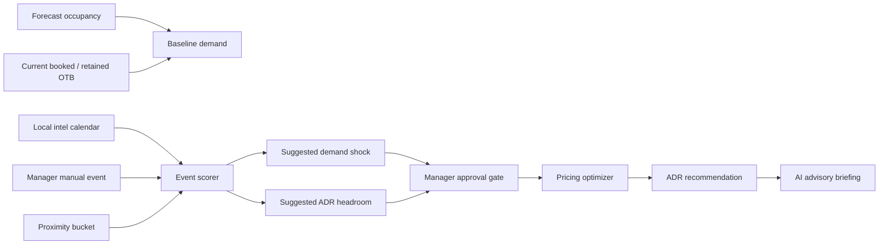

# Local Intel And Event Overlay Summary

## 1. Executive Summary

This project adds local intelligence to the Hotel RMS PoC as a transparent scenario overlay, not as a hidden model feature.

The system forecasts September 2017 occupancy for the anonymized University of Porto city-hotel dataset. The public dataset paper identifies H2 as a city hotel in Lisbon, but the exact hotel identity and location are anonymized. Therefore the project uses a "Lisbon city-hotel inspired" local-intel layer rather than claiming the real hotel address.

The implementation deliberately keeps local intel bounded:

- seeded public Lisbon events provide a future-known scenario calendar,
- manager-entered events can be added manually,
- deterministic scoring converts events into demand pressure and ADR headroom,
- proximity is handled through explicit buckets,
- DeepSeek/AI can explain and review context, but does not own ADR,
- the pricing optimizer only uses local intel after explicit manager approval.

The result is a production-grade PoC pattern: event intelligence is visible, auditable, and reversible.

## 2. Why Local Intel Was Needed

The raw hotel booking dataset is strong for historical booking behavior, cancellations, market segments, lead time, and ADR patterns. It is weak for external future-known demand drivers because the local event signal is not available as a rich historical field in the current daily table.

That matters because a hotel manager often knows things the booking history does not:

- a major match near the city,
- a festival cluster,
- a business summit,
- an exhibition,
- nearby hotels being sold out,
- a road closure or disruption,
- a wedding or group block.

For this PoC, the local-intel system demonstrates how an RMS could ingest this information safely without retraining the forecast model or letting an LLM invent prices.

## 3. Data Scope And Dataset Caveat

The underlying dataset is the Hotel Booking Demand dataset from Antonio, Almeida, and Nunes. The paper describes two hotels:

- H1: resort hotel in Algarve
- H2: city hotel in Lisbon

It also states that hotel and customer identification fields were removed for anonymity. Source: [Hotel booking demand datasets](https://repositorio.iscte-iul.pt/bitstream/10071/16929/1/Hotelbookingdemanddatasets.pdf).

Project interpretation:

- The app uses `DEFAULT_HOTEL = "City Hotel"`.
- The current forecast horizon is 2017-09-01 to 2017-09-30.
- The training / known booking data ends at 2017-08-31.
- The September 2017 local-intel layer is a scenario overlay for future dates.
- The local-intel events are not original fields from the booking dataset.
- Prices remain dollar-denominated because the existing PoC data and UI are dollar-denominated.

Presentation-safe wording:

> We use Lisbon-scoped public events to demonstrate how a production RMS could layer future-known local demand intelligence on top of an anonymized city-hotel forecast. We do not claim the exact hotel location.

## 4. End-To-End Flow



Key design principle:

> The forecast remains the baseline. Local intel creates an approved scenario overlay.

## 5. Source Files

The local-intel implementation is concentrated in these files:

- `data/local_intel_calendar.csv`: seeded Lisbon September 2017 event calendar
- `src/pricing_core/local_intel.py`: event loading, classification, proximity, scoring, clustering, guardrails
- `src/app.py`: Scenario Lab sidebar controls and manager-facing display
- `src/pricing_core/engine.py`: pricing optimizer integration
- `src/copilot_core/pricing_agent.py`: AI advisory context and manager briefing
- `src/prompts/strategist.txt`: prompt contract that passes local-intel context to AI
- `tests/test_explainable_pricing.py`: unit tests for calendar loading, scoring, proximity, clamping, clustering, and pricing impact

## 6. Seeded Lisbon Event Calendar

The project includes a transparent seed file: `data/local_intel_calendar.csv`.

Columns:

- `stay_date`
- `event_name`
- `event_category`
- `area_or_venue`
- `source_url`
- `source_quality`
- `expected_attendance`
- `proximity_bucket`
- `event_scope`
- `demand_window`
- `notes`

Seeded September 2017 events:

| Date(s) | Event | Category | Venue / Area | Attendance | Proximity bucket | Purpose in PoC |
|---|---|---:|---|---:|---|---|
| 2017-09-01 to 2017-09-03 | LISB-ON Jardim Sonoro | music_festival | Parque Eduardo VII | unknown | city_center_relevant | Medium cultural/music demand |
| 2017-09-04 to 2017-09-08 | International Conference on Computational Finance | business_conference | Lisbon | unknown | citywide | Modest business demand |
| 2017-09-12 | Benfica vs CSKA Moscow | sports_match | Estadio da Luz | 38,323 | citywide | Major sports demand |
| 2017-09-15 to 2017-09-17 | Street Hats and Caixa Alfama | cultural_cluster | Central Lisbon and Alfama | unknown | city_center_relevant | Central cultural cluster |
| 2017-09-26 | Leadership Summit Lisbon | business_conference | Lisbon Congress Centre | 1,500 | citywide | Modest business summit demand |

The calendar is intentionally small. Its job is to demonstrate the workflow, not to be a complete Lisbon event database.

## 7. Event Classification Settings

The deterministic scorer maps event type and attendance into a base profile.

| Event type | Detection rule | Base occupancy shock | Base ADR headroom | Intensity | Confidence |
|---|---|---:|---:|---:|---|
| Major Sports Event | sports category or attendance >= 30,000 | +10 pp | +12% | 0.78 | High if attendance >= 30,000, else Medium |
| Cultural / Festival Cluster | festival, cultural, or music category | +6 pp | +6% | 0.55 | Medium |
| Business Event | conference, business, summit, or 1,000 to 5,000 attendance | +3 pp | +4% | 0.35 | Medium |
| Generic Event | fallback recognized event | +5 pp | +4% | 0.45 | Medium |

Where:

- `pp` means occupancy percentage points.
- Occupancy shock affects demand used by pricing.
- ADR headroom affects how much market premium the optimizer is allowed to consider.
- These are suggested impacts only until the manager applies the overlay.

## 8. Proximity Logic

The anonymized dataset does not provide exact hotel coordinates. Instead, the project uses proximity buckets.

Calendar events carry their own `proximity_bucket` in `data/local_intel_calendar.csv`.

Manual events can use:

- deterministic text inference,
- a Scenario Lab proximity selector,
- or no proximity if the manager does not specify it.

Current proximity factors:

| Bucket | Factor | Meaning |
|---|---:|---|
| nearby | 1.20x | Event is close to the hotel or walkable |
| city_center_relevant | 1.00x | Event is central enough to matter for an anonymized city hotel |
| citywide | 0.90x | Event affects the broader city market |
| distant_or_uncertain | 0.65x | Location is far, unclear, or weakly relevant |
| not_specified | 1.00x | Manual event gave no proximity; do not silently penalize it |

Examples of inferred manual proximity:

| Bucket | Example phrases |
|---|---|
| nearby | nearby, next door, walking distance, same block, near the hotel, around the corner |
| city_center_relevant | city center, city centre, downtown, central Lisbon, business district, historic centre |
| citywide | across the city, whole city, entire city, multiple venues, hotels full, city sold out |
| distant_or_uncertain | outskirts, outside Lisbon, far from hotel, airport area, unknown location, not sure where |

Formula:

```text
proximity_adjusted_shock = base_shock * proximity_factor
proximity_adjusted_adr_headroom = base_adr_headroom * proximity_factor
```

ADR headroom is still capped at 20%.

## 9. Manual Event Handling

Scenario Lab includes a manual local-event input:

```text
Enter local event (e.g., 'music event nearby')
```

When a manual event is entered, the UI also shows:

```text
Manual event proximity:
  Infer from text
  Nearby / walking distance
  City center relevant
  Citywide
  Distant or uncertain
```

This gives two levels of control:

- Natural-language convenience for quick demos.
- Explicit manager override when the inferred bucket is wrong.

Manual event examples:

| Input | Classification | Proximity behavior | Expected behavior |
|---|---|---|---|
| `100-person wedding block nearby` | Event | nearby inferred | Stronger local event impact |
| `music festival nearby` | Event | nearby inferred | Demand and ADR headroom lifted by 1.20x |
| `conference across the city with hotels full` | Event | citywide inferred plus sell-out language | High-confidence compression event |
| `event outside Lisbon` | Ambiguous or Event, depending on event terms | distant_or_uncertain inferred | Reduced impact |
| `big traffic jam at the entry of the city` | Operational Disruption / Ambiguous Demand | no positive demand by default | Context only unless stranded-room demand is explicit |

## 10. Calendar Plus Manual Event Clustering

If a seeded calendar event exists for the date and the manager enters another event, the system combines them as an event cluster.

Example:

- Calendar date: 2017-09-12 has Benfica vs CSKA Moscow.
- Manager enters: `music event nearby`.
- Result: `Local Event Cluster`.

Cluster formula:

```text
raw_cluster_shock = calendar_raw_shock + (0.65 * manual_raw_shock)
applied_cluster_shock = min(18 pp, raw_cluster_shock, available_occupancy_room)

cluster_adr_headroom =
    min(20%, max(calendar_headroom, manual_headroom)
             + 0.50 * min(calendar_headroom, manual_headroom))
```

Why discount the second event?

The two events may attract overlapping demand. A manager-entered event should strengthen the date, but the system should not simply add every event at full value and overstate demand.

## 11. Raw Demand Pressure Versus Applied Demand

The estimator now separates:

- raw event pressure: what the event suggests before occupancy constraints,
- applied occupancy shock: what can actually be added without exceeding 100% occupancy.

Formula:

```text
available_occupancy_room = max(0, 1 - max(current_occ, forecast_occ))
applied_occupancy_shock = min(raw_occupancy_shock, available_occupancy_room)
```

Example:

If a business event suggests +2.7 pp demand but the hotel is already effectively full:

```text
raw_occupancy_shock = +2.7 pp
available_occupancy_room = 0.0 pp
applied_occupancy_shock = +0.0 pp
```

The UI should not make this look like the event had no importance. It shows:

```text
Demand: +0.0% applied (+2.7% raw)
```

The ADR headroom can still matter even when the demand shock is capped. That is important because a full hotel may not need more rooms demanded, but it may still justify protecting rate or allowing a stronger market premium.

## 12. Market Proof Boost

Some event impacts become stronger when the market already shows supporting evidence.

The upper tier can activate if:

```text
market_regime in {"event_compression", "market_wide_sellout"}
or retained_pace_index > 1.2
or pickup_trend_index > 1.2
```

When the boost activates:

- Major sports events can rise to +18 pp occupancy shock and +20% ADR headroom.
- Other events can add +2 pp occupancy shock and +3% ADR headroom, within caps.

This prevents the event overlay from acting alone. Stronger event impact needs either event scale or market proof.

## 13. Approval Gate

Local intel is never applied automatically.

Scenario Lab shows:

- event type,
- demand impact,
- raw versus applied demand when capped,
- ADR headroom,
- confidence,
- proximity,
- evidence,
- manager rationale,
- guardrail or clamp reason.

The manager can choose:

- `Apply local intel scenario overlay`
- or leave it as context only.

If there is no calendar event and no manual event input, the system avoids local-intel wording entirely. It does not say "local intel included as context only" when there is no local intel.

## 14. Pricing Integration

When approved, local intel enters the pricing optimizer through two separate fields:

```text
local_intel_applied_shock
local_intel_applied_adr_headroom
```

Demand integration:

```text
base_occ = max(forecasted_occupancy, adjusted_otb_occupancy)
total_shock = manual_demand_shock + local_intel_applied_shock
sim_occ = clamp(base_occ + total_shock, 0, 1)
```

Inside the pricing engine:

```text
manual_occ = organic_occupancy + manual_shock
demand_anchor = manual_occ + local_intel_shock
demand_anchor = clamp(demand_anchor, 0, 1)
```

ADR headroom integration:

```text
local_intel_adr_headroom_pct = clamp(local_intel_adr_headroom_pct, 0, 20%)
allowed_premium_pct = max(existing_market_premium, local_intel_adr_headroom_pct)
```

This is the key mature-design decision:

- Occupancy shock changes the demand anchor.
- ADR headroom changes the allowed market premium / compression policy.
- Suggested impact and applied impact remain separate.
- The optimizer still chooses ADR through candidate-price revenue search.

## 15. AI Advisory Integration

DeepSeek is used as an advisory reviewer, not as a price setter.

The strategist prompt receives:

- local-intel suggested demand impact,
- whether local intel was included in the optimizer,
- local-intel applied demand impact,
- local-intel suggested ADR headroom,
- local-intel applied ADR headroom,
- total demand shock,
- the full local-intel estimate JSON,
- manual event text.

Prompt contract:

- The optimizer owns ADR.
- AI must not invent, adjust, or override price.
- If local intel is not included, AI must say it was context only.
- AI writes a manager-friendly briefing and flags risk.

This makes the AI useful for explanation while keeping revenue math deterministic.

## 16. Manager-Facing UX

Scenario Lab now supports three local-intel modes:

1. No local intel
   - No local-intel wording appears.
   - The optimizer runs from baseline forecast, current state, manual demand slider, pace, and market context.

2. Calendar-only local intel
   - The seeded event is selected from the Local Intel Calendar.
   - The event is scored from the calendar category, attendance, and proximity bucket.
   - It is not applied unless approved.

3. Calendar plus manual local intel
   - A seeded event and manager-entered event are combined as a cluster.
   - The cluster uses discounted additive demand and combined ADR headroom.
   - Evidence from both sources is shown.

Visible manager output includes:

- `Type`
- `Demand`
- `ADR headroom`
- `Confidence`
- `Proximity`
- clamp reason if demand was capped
- manager rationale
- evidence/source
- explicit apply checkbox

## 17. Example Walkthroughs

### Example 1: Benfica Match On 2017-09-12

Calendar:

```text
Benfica vs CSKA Moscow
Category: sports_match
Attendance: 38,323
Proximity: citywide
```

Base scoring:

```text
Major sports base shock = +10 pp
Major sports base ADR headroom = +12%
citywide factor = 0.90x
raw shock = +9 pp
raw ADR headroom = +10.8%
```

If market proof activates, the top tier can lift this toward:

```text
shock = up to +18 pp
ADR headroom = up to +20%
```

### Example 2: Leadership Summit On 2017-09-26

Calendar:

```text
Leadership Summit Lisbon
Category: business_conference
Attendance: 1,500
Proximity: citywide
```

Base scoring:

```text
Business event base shock = +3 pp
Business event base ADR headroom = +4%
citywide factor = 0.90x
raw shock = +2.7 pp
raw ADR headroom = +3.6%
```

If the hotel is already full:

```text
applied demand shock = +0.0 pp
raw event pressure = +2.7 pp
ADR headroom remains available if manager approves
```

### Example 3: Calendar Sports Event Plus Manual Music Event

Calendar:

```text
Benfica vs CSKA Moscow
```

Manual input:

```text
music event nearby
```

Result:

```text
classification = Local Event Cluster
source = seeded_calendar_plus_manual_intel
```

The manual event is not ignored. It is combined with the known sports event, but discounted to avoid double-counting overlapping demand.

## 18. Guardrails

The local-intel system applies these guardrails:

- Event impact is advisory until explicitly approved.
- Occupancy impact cannot push demand beyond 100%.
- ADR headroom is capped at 20%.
- High event tiers need strong event scale or market proof.
- Low-confidence or ambiguous intel remains context only.
- Traffic/access disruption does not become positive demand unless stranded-room demand is explicit.
- Competitor-only text affects benchmarking context, not occupancy shock.
- The source hotel is anonymized, so proximity uses buckets rather than exact distance.
- Local intel is documented as an external overlay, not an original booking-dataset field.
- AI cannot override ADR or invent event facts.

## 19. Validation Coverage

The test suite covers:

- seeded September 2017 events load correctly,
- dates without events stay context-free,
- Benfica match scores stronger than a small business event,
- manual events combine with seeded events as clusters,
- cultural/festival clusters produce medium city-center impact,
- business events preserve raw event pressure when applied demand is capped,
- proximity inference recognizes similar wording,
- manager proximity override changes manual-event impact,
- context-only local intel does not change optimizer input,
- approved local intel changes demand anchor and ADR headroom,
- manager summary includes local intel only when meaningful,
- no local-intel input produces no local-intel wording.

Recent validation command:

```text
python -m unittest discover -s tests
```

Recent result:

```text
Ran 153 tests
OK
```

## 20. What This Demonstrates In A Presentation

Slide storyline:

1. The baseline model forecasts occupancy from historical booking data.
2. External events are future-known demand signals that may not exist in the historical table.
3. A production RMS should not let free text directly set price.
4. This PoC converts event context into transparent demand and ADR-headroom signals.
5. The manager sees evidence, confidence, proximity, raw impact, applied impact, and guardrails.
6. Only approved local intel affects the optimizer.
7. AI writes a briefing, but deterministic pricing owns ADR.

One-slide summary:

> Local intel is implemented as a controlled event-intelligence overlay: seeded Lisbon events and manager-entered events are classified, proximity-adjusted, capped by occupancy, and separated into demand shock and ADR headroom. The optimizer only uses the overlay after approval, while AI remains an advisory explanation layer.

## 21. Limitations

This is still a PoC, not a full production event-demand platform.

Current limitations:

- The event calendar is manually seeded and intentionally small.
- Event attendance is missing for some cultural/festival entries.
- Exact hotel distance is unavailable because the hotel is anonymized.
- Event impact coefficients are deterministic business rules, not statistically learned causal effects.
- The September 2017 overlay demonstrates workflow rather than proving real uplift.
- DeepSeek is not yet used to parse structured event objects from arbitrary free text in this scoring path.
- No external live event API is integrated.
- No competitor pickup or citywide sellout feed is ingested in real time.

These are acceptable for a production-grade MVP demonstration because the system is honest about what is known, what is assumed, and what is manager-approved.

## 22. Production Roadmap

Natural next steps:

1. Add a proper event-ingestion table with event IDs, recurrence, venue coordinates, attendance confidence, and update timestamps.
2. Add hotel-location profiles with approximate neighborhood or distance bands instead of exact coordinates when privacy requires it.
3. Use DeepSeek as a structured parser for manager-entered text:

```json
{
  "event_name": "string",
  "event_category": "business_conference | sports_match | music_festival | cultural_cluster | disruption | other",
  "expected_attendance": 1500,
  "proximity_bucket": "nearby | city_center_relevant | citywide | distant_or_uncertain",
  "confidence": "Low | Medium | High",
  "evidence_needed": ["attendance", "venue", "date"]
}
```

4. Keep deterministic scoring as the owner of demand and ADR headroom.
5. Add event-source freshness and confidence scoring.
6. Compare future pickup against event and non-event dates to learn better multipliers.
7. Add comp-set compression signals from market-rate feeds.
8. Add approval history so managers can audit which event overlays were applied.

## 23. Likely Q&A

**Q: Is local intel part of the original hotel booking dataset?**  
A: No. It is an external scenario overlay for September 2017, used to demonstrate production RMS workflow.

**Q: Why use Lisbon?**  
A: The public dataset paper identifies H2 as a Lisbon city hotel, but the exact hotel is anonymized. The PoC uses Lisbon-scoped public events without claiming exact hotel location.

**Q: Does AI set the local-intel impact?**  
A: No. Deterministic rules set demand shock and ADR headroom. AI can review and explain the result.

**Q: Why can an event show 0% applied demand but still matter?**  
A: If current or forecast occupancy is already near 100%, there may be no remaining occupancy room. The raw event pressure is still shown, and ADR headroom can still protect rate.

**Q: Why separate demand shock and ADR headroom?**  
A: More demand and more pricing power are related but not identical. A full hotel may not need more demand, but a major event can still justify a stronger rate posture.

**Q: Why not simply add every event impact together?**  
A: Events can attract overlapping demand. The cluster logic discounts secondary manual-event impact to avoid overstating demand.

**Q: What makes this more mature than a naive 10% event uplift?**  
A: It includes event category, attendance, proximity, market proof, raw versus applied demand, ADR headroom, confidence, evidence, manager approval, and AI advisory separation.

**Q: Could this become production-grade?**  
A: Yes. The current design already separates ingestion, scoring, approval, optimizer integration, and advisory explanation. The next step is richer event feeds and learned calibration from pickup data.

