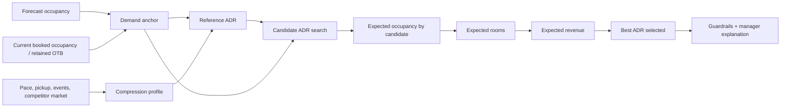

# Pricing Optimization Summary

## 1. Executive Summary

This project is a proof-of-concept hotel revenue management system for a single-property manager.  
The current pricing layer is intentionally **transparent and deterministic**:

- a forecast model estimates future occupancy,
- a rule-based optimizer evaluates candidate ADRs,
- the system selects the ADR with the highest modeled room revenue,
- DeepSeek is used only as an **advisory and explanation layer**, not as the price owner.

The current version is best described as:

> **Heuristic price optimization with a parametric demand curve**

or, more plainly:

> **Rule-based revenue optimization using candidate-price search**

This is a credible MVP because it demonstrates the full decision workflow, keeps business logic inspectable, and creates a clear path toward learned demand-response models later.

---

## 2. What the System Is Trying to Do

For each future stay date, the system asks:

> Given current demand, booking pace, market pricing, and inventory signals, which allowed ADR is expected to produce the highest room revenue?

It does **not** yet claim to know the true causal effect of every price change from historical data alone.  
Instead, it uses a transparent heuristic demand model, searches over candidate prices, and exposes the reasoning to the manager.

---

## 3. End-to-End Pricing Flow



### Important state distinction

The system deliberately keeps these separate:

- **Current booked occupancy (raw OTB)**: how much is already booked now
- **Retained OTB after expected cancellations**: booked demand after cancellation risk
- **Forecast occupancy**: model-based expectation for the stay date

This matters because those concepts answer different questions and should not be blurred in either pricing logic or manager-facing explanations.

---

## 4. Core Inputs Used in Pricing

For each stay date, the optimizer uses:

- forecast occupancy
- raw booked occupancy
- retained OTB after cancellations
- booked pace
- recent pickup trend
- competitor median / high rates
- local-event shock if approved
- lead time to stay date
- recent hotel ADR history

The model also preserves sold-out semantics:

- if raw OTB reaches capacity, the system enters a sold-out regime,
- sold-out pricing cannot fall below competitor parity,
- if raw booked occupancy is full but retained occupancy is materially lower after cancellations, the system explicitly flags the date for review.

---

## 5. Pricing Logic in Formula Form

### 5.1 Demand anchor

The demand anchor is the priced-demand starting point:

```text
Demand anchor =
max(forecast occupancy, retained OTB)
+ approved manual demand shock
+ approved local-intel shock
+ composite pace adjustment
```

It is capped between 0% and 100%.

### 5.2 Compression score

Compression score is a hand-designed 0-1 signal that summarizes how tight demand appears to be.

```text
Raw compression score =
  40% * occupancy score
+ 20% * scarcity score
+ 12% * gross pace score
+  8% * pickup score
+ 10% * lead-time score
+ 10% * event score
```

Then:

```text
Final compression score =
clamp01(
  raw score * (0.75 + 0.25 * retention confidence)
  + market-regime bonus
)
```

These weights are currently **heuristic**, not learned from data.

### 5.3 Reference ADR

The reference ADR blends hotel history with market context:

```text
Market pull = 0.20 + 0.60 * compression score

Compression lift =
competitor median ADR
* allowed premium %
* 0.50
* compression score

Reference ADR =
base ADR * (1 - market pull)
+ competitor median ADR * market pull
+ compression lift
```

The result is then clipped inside dynamic minimum and maximum price bounds.

### 5.4 Candidate-price demand curve

For each allowed candidate ADR:

```text
Price change % =
(candidate ADR - reference ADR) / reference ADR

Base expected occupancy =
demand anchor * e^(-elasticity * price change %)
```

The optimizer then applies a bounded market-context adjustment depending on whether the candidate ADR is:

- below competitor median,
- within allowed premium headroom,
- above competitor median,
- above competitor high.

### 5.5 Expected rooms and revenue

```text
Expected rooms = expected occupancy * hotel capacity

Expected revenue = candidate ADR * expected rooms
```

The chosen ADR is the candidate with the highest expected revenue.

---

## 6. Worked Example: Sep 30

### Given

```text
Booked ADR                 = $152.69
Recommended ADR            = $145.00
Reference ADR              = $149.30
Demand anchor              = 95.39%
Elasticity                 = 1.00
Hotel capacity             = 237 rooms
```

### Candidate ADR = $145

```text
Price change %
= (145.00 - 149.30) / 149.30
= -2.88%

Base expected occupancy
= 95.39% * e^(-1.00 * -2.88%)
= 98.18%

After competitor-context adjustment
= 98.57%

Expected rooms
= 98.57% * 237
= 233.60 rooms

Expected revenue
= $145 * 233.60
= $33,872.34
```

### Comparison point for booked ADR

The optimizer searches in $5 increments, so actual booked ADR of $152.69 is represented by the nearest candidate price, $155.

```text
At $155:
expected rooms   = 215.06
expected revenue = $33,334.15
```

### Revenue gain vs booked ADR

```text
$33,872.34 - $33,334.15 = $538.19
```

Interpretation:

> The model estimates that pricing the stay date around $145 instead of the booked-ADR proxy of $155 would produce about $538 more **total stay-date room revenue** because it expects the lower rate to stimulate enough additional occupancy.

Important caveat:

> This is a whole-hotel modeled comparison, not yet a remaining-room-only revenue calculation.

---

## 7. Role of AI in the Current MVP

DeepSeek is intentionally bounded.

### AI does

- write concise manager-facing explanations,
- identify review risk,
- summarize opportunity themes,
- convert messy context into structured advisory text.

### AI does not

- set ADR,
- override the optimizer,
- silently apply local-event shocks,
- replace deterministic validation.

This separation was chosen because direct AI ownership of price would make the system look like a black box and reduce trust.

---

## 8. What Is Learned vs Heuristic Today

### Already data-driven

- occupancy forecasting layer
- model selection through backtesting
- interval calibration
- recent-history ADR anchors

### Still heuristic

- compression-score weights
- premium headroom bands
- elasticity adjustments
- competitor-context adjustments
- current demand-response curve

The MVP is therefore best positioned as:

> a **transparent decision system** with a learned forecast layer and an explainable heuristic pricing layer.

---

## 9. Why This Is Good Enough for an MVP

The current version already demonstrates the most important product and systems decisions:

1. **The workflow is real**  
   Forecast → live market state → price optimization → advisory briefing → manager action.

2. **The semantics are correct**  
   Current booked, retained OTB, and forecast occupancy are kept separate.

3. **The decision path is inspectable**  
   Every recommendation can be decomposed into base rate, reference rate, candidate search, guardrails, and review flags.

4. **The architecture is production-shaped**  
   Forecasting, pricing, advisory AI, and UI are separated cleanly enough to evolve independently.

5. **The limitations are explicit**  
   The current pricing layer is an engineered baseline, not a final learned demand-response system.

---

## 10. Current Limitations

### 10.1 Hand-tuned weights

Compression weights are currently based on domain judgment, not estimated coefficients.

### 10.2 Price-response learning is not yet causal

Historical bookings alone are not enough to honestly learn how demand changes at prices the hotel did not choose.  
The project still lacks the exposure data required for stronger price-response learning, such as:

- price shown,
- search / quote event,
- no-book outcome,
- competitor price at exposure time,
- segment / channel,
- later cancellation outcome.

### 10.3 Revenue-upside metric is still a modeled comparison

The Today dashboard currently compares recommended ADR against booked ADR across the modeled whole stay date.  
For production use, a more manager-safe metric would likely be:

> **remaining-room revenue opportunity**

which estimates value only on inventory still available to sell.

---

## 11. Recommended Next Steps After the MVP

### Phase 1 — Improve the current heuristic layer

- learn compression weights from realized outcomes,
- backtest alternative score designs,
- calibrate premium bands by demand regime,
- add remaining-room revenue opportunity metrics.

### Phase 2 — Start collecting the right data

- quote / search exposures,
- no-book outcomes,
- rate shown,
- market state at decision time,
- channel / segment,
- later booking and cancellation outcomes.

### Phase 3 — Learn demand response

- estimate context-dependent elasticity,
- compare price policies offline,
- use safe experiments before broad rollout,
- move from hand-coded price-response rules toward learned demand curves.

### Phase 4 — Production RMS evolution

- channel and segment controls,
- experimentation framework,
- offline policy evaluation,
- selective automation within approved guardrails.

---

## 12. Suggested Talking Points for Presentation

### 30-second version

> We built a transparent hotel RMS MVP where forecasting is learned, pricing is deterministic, and generative AI is advisory only. The optimizer evaluates candidate ADRs against an explicit demand curve and chooses the price with the highest modeled revenue, while preserving manager trust through explainable logic and guardrails.

### What to emphasize to a lead data scientist

- The forecasting stack is already more mature than the pricing layer.
- The pricing layer is intentionally heuristic for MVP speed and explainability.
- The system is architected so that heuristic components can be replaced incrementally by learned components.
- The biggest future value is not “more LLM,” but better demand-response data and experimentation.

### What not to oversell

- Do not claim causal elasticity learning yet.
- Do not present compression-score weights as empirically estimated.
- Do not imply the system already knows the true optimum price in a production sense.

---

## 13. Likely Questions and Prepared Answers

### Q: What pricing technique is this?

**A:** Heuristic price optimization with a parametric demand curve and discrete candidate-price search.

### Q: Are the compression weights learned?

**A:** Not yet. They are hand-designed domain heuristics for the MVP and are a clear future replacement target.

### Q: Why is AI not directly setting the price?

**A:** Because the product goal is trusted decision support. The optimizer owns ADR; AI explains, reviews, and structures context.

### Q: What data is needed for a stronger next version?

**A:** Exposure data: rate shown, market context, quote/search events, booking or no-book outcomes, channel, segment, and cancellation results.

### Q: What is the most valuable future upgrade?

**A:** Learn context-dependent price response so the system can estimate how far above or below market it can move without harming conversion.
