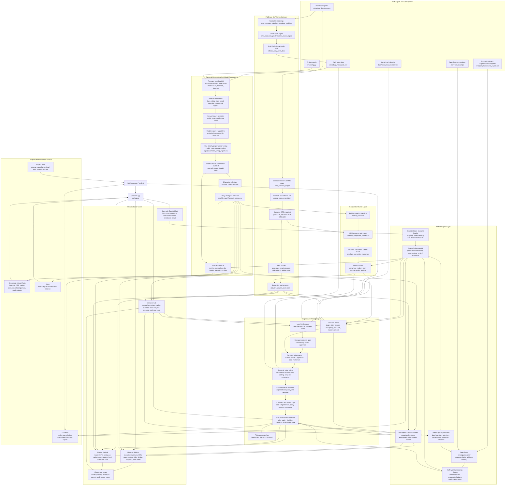

# Hotel RMS Project Functionality Flowchart

This Mermaid flowchart maps the current Hotel RMS PoC end to end: source data, PMS simulation, demand forecasting, backtesting, market feed, pricing optimization, Streamlit surfaces, Scenario Lab, copilot layers, artifacts, and tests.

## Functional Coverage

- **Forecast pipeline:** raw bookings become daily demand history, engineered forecast features, Boruta-selected ML features, tuned model parameters, backtest artifacts, champion metadata, and daily demand forecasts.
- **Live hotel state:** live PMS ledger and OTB snapshot produce booked rooms, cancellation-adjusted retained rooms, booked ADR, pace signals, and a JSON market state consumed by the UI and pricing engine.
- **Competitor market:** simulated comp-set feed provides low / median / high rates, market regime, source quality, and override-able Scenario Lab market context.
- **Pricing engine:** forecast occupancy, OTB, pace, market context, local-intel overlays, dynamic price policy, candidate revenue optimization, and guardrails produce an explainable final ADR.
- **Local intelligence:** seeded calendar events and manager-entered events are scored into suggested demand pressure and ADR headroom, but affect pricing only after explicit approval.
- **AI layer:** DeepSeek/LangGraph components explain and route, while deterministic code owns pricing, scenario execution, data lookups, and confirmation gates.
- **Streamlit app:** Morning Briefing, Market Outlook, Scenario Lab, charts, traces, audit tables, and Scenario Copilot chat expose the system to a manager.
- **Governance:** tests, docs, audit metrics, model comparison artifacts, price-path traces, guardrail rows, and decision logs keep the PoC inspectable.
