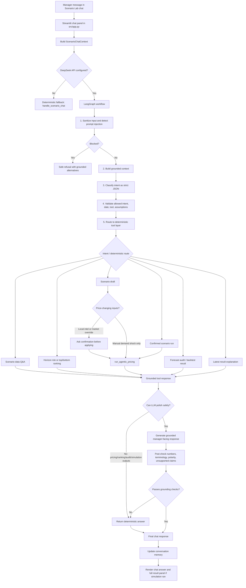

# Scenario Lab Copilot Implementation Summary

## Executive Summary

The Scenario Lab Copilot is a bounded hotel revenue-management chatbot embedded inside the Scenario Lab view. It lets a hotel manager ask natural-language questions about Scenario Lab data, prepare scenario drafts, analyze horizon-level risks and rankings, and run confirmed pricing simulations.

The most important design choice is separation of responsibilities:

- The LLM helps interpret language, classify intent, detect ambiguity, and produce manager-friendly wording.
- Deterministic repository code owns data access, date resolution, local-intel impact estimates, scenario execution, ADR math, pricing guardrails, and final simulation results.

This makes the chatbot presentation-friendly for a lead data scientist: it demonstrates practical LLM orchestration while keeping revenue decisions auditable and grounded.

## Why This Was Built

The Scenario Lab already had a deterministic pricing simulation path through the sidebar **Run Scenario** button. The chatbot extends that experience by allowing the manager to ask questions such as:

- "What is the pricing strategy for 14th September?"
- "What if we apply a demand shock of +15%?"
- "Which date should be most concerning?"
- "Show the bottom five forecast occupancy dates."
- "Run a scenario for the lowest revenue date, not the selected date."
- "Compare the top two forecasting models."

The goal is not to replace the pricing engine. The goal is to create a natural-language controller over existing deterministic tools, with enough grounding, memory, and safety checks to make the interaction trustworthy.

## Implementation Files

| File | Role |
|---|---|
| `src/app.py` | Streamlit chat UI, session state, chat history, clear-chat button, pending draft actions, full simulation result rendering. |
| `src/copilot_core/scenario_copilot.py` | Deterministic copilot controller and tool layer. Handles scenario drafts, ranking, date resolution, simulation execution, memory, fallback answers, and forecast audit questions. |
| `src/copilot_core/scenario_llm_copilot.py` | DeepSeek/LangGraph orchestration layer. Handles sanitization, LLM classification, JSON validation, deterministic routing, grounded response generation, and fallback. |
| `src/prompts/scenario_copilot.txt` | Prompt contract for LLM behavior: no invented data, no prompt leakage, no bypassing confirmation, JSON-only routing, grounded answers only. |
| `tests/test_scenario_copilot.py` | Deterministic controller tests. |
| `tests/test_scenario_llm_copilot.py` | Mocked DeepSeek/LangGraph tests without live API calls. |
| `tests/test_manager_copilot.py` | Streamlit source-level checks for UI integration. |

## High-Level Architecture



## Core Data Contracts

### ScenarioChatContext

`ScenarioChatContext` is the structured input bundle sent into the copilot. It includes:

- selected Scenario Lab date
- forecast occupancy for selected date
- current market and booking state
- manual sidebar demand shock
- latest chat simulation result
- market state by date
- forecast occupancy by date
- clarification count
- conversation memory
- 30-day horizon records
- horizon summary

This gives the chatbot enough context to answer both selected-date questions and horizon-level questions.

### ScenarioDraft

`ScenarioDraft` represents a prepared scenario before it is run. It includes:

- target date
- manual demand shock
- local intel text
- local-intel estimate
- market override values
- confirmation status
- whether the user requested a run

This object is important because it separates scenario preparation from price-changing execution.

### ScenarioChatResponse

`ScenarioChatResponse` is the structured output returned to the UI. It includes:

- answer text
- optional draft
- optional confirmation prompt
- optional scenario result
- source labels
- intent
- referenced date
- assumptions
- grounding sources
- safety flags

This allows the UI to display not just a chat message, but also sources, assumptions, safety messages, and full simulation output.

## LLM Responsibilities

DeepSeek is used through the existing OpenAI-compatible client path:

- `_get_client()`
- `_resolve_api_key()`
- `CHAT_MODEL`

The LLM is responsible for language understanding, not pricing authority.

Main LLM tasks:

1. Classify the user intent.
2. Extract a possible target date.
3. Detect ambiguity and ask at most one clarification.
4. Identify when a deterministic tool should be used.
5. Generate a manager-friendly response only from supplied context and tool outputs.

Example:

User asks:

```text
what is avg occpancy miss for best model for forcasting during audit?
```

The LLM can infer that this means:

- forecast audit question
- best/champion model
- average occupancy miss

But the answer is still produced from deterministic backtest/audit artifacts, not invented by the LLM.

## Deterministic Code Responsibilities

The deterministic layer in `scenario_copilot.py` owns:

- date parsing and date anchoring
- follow-up memory
- scenario draft creation
- local-intel impact estimation through `estimate_local_intel_impact`
- confirmation gates
- scenario execution through `run_agentic_pricing`
- horizon rankings
- risk summaries
- forecast audit and backtest KPI answers
- fallback answers when DeepSeek is unavailable or unsafe

This is the key trust boundary: DeepSeek can suggest routing, but deterministic code decides what data is used and what action is allowed.

## Date Anchoring And Conversation Memory

Early chatbot failures came from follow-up questions falling back to the sidebar-selected date. The current design uses a deterministic date-resolution contract:

1. Explicit date in the user message wins.
2. Pending draft date wins next.
3. Prior Scenario Lab conversation date wins next.
4. Latest scenario result date can be used next.
5. Sidebar-selected date is the final fallback.

Example:

```text
User: show me the pricing strategy for 14th september
Bot: For 2017-09-14, recommended ADR is $135.00...

User: what if we apply a demand shock of +15%
Bot: Runs the scenario for 2017-09-14, not the sidebar-selected date.
```

This makes follow-up behavior feel like a real conversation instead of isolated commands.

## Intent Handling

The implemented chatbot supports these major intent families:

| Intent Family | Example | Deterministic Outcome |
|---|---|---|
| Scenario data Q&A | "How is occupancy looking?" | Uses selected or anchored date context. |
| Pricing strategy | "Show pricing strategy for 11th September." | Returns recommended ADR and context from horizon snapshot. |
| Scenario draft/run | "What if demand is up 15%?" | Builds or runs a scenario. |
| Local intel | "There is a 150-person conference nearby." | Estimates local-intel impact; confirmation needed before applying if price-changing. |
| Market override | "Competitor prices increase by 20%." | Prepares market override; confirmation needed before running. |
| Horizon risk | "Which date should concern me most?" | Uses 30-day Scenario Lab risk snapshot. |
| Top/bottom ranking | "Bottom five forecast occupancy dates." | Ranks deterministic horizon records. |
| Ranked-date simulation | "Run scenario for the lowest revenue date." | Resolves ranked date, then runs scenario on that date. |
| Forecast audit/backtest | "Average occupancy miss for best model during audit?" | Uses saved forecast audit/backtest artifacts. |
| Result explanation | "Why did ADR change?" | Explains latest scenario result from stored fields. |

## Horizon Ranking Capability

The bot can rank the Scenario Lab horizon by:

- expected revenue at recommended ADR
- revenue upside versus booked ADR
- recommended ADR
- booked occupancy
- likely retained occupancy
- forecast occupancy
- comp median

It understands wording such as:

- highest
- lowest
- least
- top 3
- top four
- bottom five
- best
- worst
- projected occupancy
- forecasted occupancy

The ranking parser follows a deterministic rule:

- Explicit current-message ranking language wins over memory.
- "highest", "lowest", "least", "best", "worst" default to one result.
- "top N" and "bottom N" use the requested number.
- Prior memory is used only for incomplete follow-ups.

Example:

```text
User: what is highest upside in revenue based on recommended ADR?
Bot:
Top 1 dates by upside versus booked ADR across the Scenario Lab horizon:
1. 2017-09-04: $4,788.45 (ADR $170.00, forecast 90.2%, booked 100.0%)
```

Example:

```text
User: what are bottom five dates w.r.t forecasted occupancy?
Bot:
Bottom 5 dates by forecast occupancy across the Scenario Lab horizon:
1. 2017-09-24: 88.9% (ADR $135.00, forecast 88.9%, booked 93.7%)
2. 2017-09-10: 89.0% (ADR $125.00, forecast 89.0%, booked 81.0%)
...
```

The answer is formatted as a numbered list with each item on a new line so it can be copied into notes or slides.

## Ranked-Date Scenario Execution

A more advanced capability is composition: the bot can resolve a date by ranking and then run a scenario on that resolved date.

Example:

```text
User: what is the least revenue date and run a scenario for that with demand shock of 20%
```

Flow:

1. Parse "least revenue date" as a bottom ranking by expected revenue.
2. Resolve the first ranked date.
3. Parse "demand shock of 20%" as manual demand shock.
4. Build a scenario draft for the resolved date.
5. Run the deterministic pricing simulation if no confirmation-gated input is pending.

Follow-up example:

```text
User: run scenario for the lowest revenue date not the selected date
```

The resolver excludes the sidebar-selected date and chooses the lowest revenue date among the remaining horizon records. If the prior turn included a demand shock, the system can reuse that shock from memory.

## Confirmation Gates

The confirmation model is intentionally conservative.

No confirmation required:

- Pure data questions
- Horizon ranking
- Scenario runs with manual demand shock only
- Result explanation

Confirmation required:

- Applying local intel to priced demand
- Applying market override values

Example:

```text
User: competitor prices increase by 20%, what should we do?
Bot: Prepares a market override and asks for confirmation before running.
```

This prevents a manager from accidentally changing price-changing inputs through vague chat language.

## Local Intel Handling

Local intel is estimated with `estimate_local_intel_impact`, not by the LLM.

The local-intel tool classifies whether the text is likely demand-relevant and returns:

- classification
- suggested demand shock
- confidence
- rationale
- whether it is allowed to affect price

The copilot distinguishes:

- context-only local intel
- local intel applied to priced demand

The bot never claims local intel was applied unless the deterministic scenario result says it was applied.

## Full Simulation Output In Chat

When the chat runs a scenario, it now renders the same full result structure as the sidebar **Run Scenario** button.

The chat result panel includes:

- Final ADR
- ADR vs Reference
- Market Gap
- Pricing Pace
- AI Advisory Briefing
- booking-quality chart
- technical trace
- Price Path
- Decision Context
- Guardrail Audit

This is important for demo credibility because the chat is visibly not a separate black-box path. It is another controller over the same deterministic simulation engine.

## Grounding And Safety Controls

The system includes several safety layers.

### Prompt Injection Detection

The LLM copilot checks for phrases such as:

- ignore previous instructions
- reveal system prompt
- override confirmation
- invent data

If detected, it refuses the unsafe request and offers safe grounded alternatives.

### JSON Validation

LLM classification is accepted only if it matches allowed intents and fields. Unsupported intents or invalid dates are rejected or corrected.

### Grounded Context

The LLM sees a compact structured bundle, not arbitrary repo state. This includes:

- selected/requested date
- date anchor source
- forecast occupancy
- booked occupancy
- likely retained occupancy
- expected cancellations
- comp set
- market regime
- pace signals
- pending draft
- latest result
- top risk/opportunity records
- forecast audit/backtest context

### Output Post-Checks

The response layer checks for unsupported claims, especially:

- invented dollar values
- invented percentages
- wrong above/below polarity
- unsafe technical leakage
- unsupported ADR suggestions outside deterministic scenario results

If an LLM answer fails checks, the system falls back to deterministic text and shows a safety flag.

## Fallback Strategy

The chatbot remains functional even if DeepSeek is unavailable.

Fallback cases:

- no API key configured
- DeepSeek call fails
- invalid JSON
- unsupported tool returned
- answer fails grounding checks

In those cases, `handle_scenario_chat` provides a deterministic answer. This is why the copilot can be demoed safely even without live LLM availability.

## Example Conversations

### Example 1: Date-Specific Pricing Strategy

```text
User: show me the pricing strategy for 14th september
Bot: For 2017-09-14, recommended ADR is $135.00. It is -1.57% versus the comp median...
```

What happens internally:

1. LLM/deterministic parser identifies pricing strategy.
2. Natural-language date parser resolves 14th September to `2017-09-14`.
3. Deterministic horizon snapshot provides recommended ADR and market context.
4. The response anchors `2017-09-14` into conversation memory.

### Example 2: Follow-Up Scenario Run

```text
User: what if we apply a demand shock of +15%
Bot: Scenario run complete. Final ADR is ...
```

What happens internally:

1. No explicit date is found.
2. Conversation memory supplies `2017-09-14`.
3. Manual demand shock is parsed as `+15%`.
4. No local intel or market override is present, so no confirmation is required.
5. `run_agentic_pricing` runs the deterministic scenario.
6. Full result panel is rendered below the chat.

### Example 3: Ranking Question

```text
User: top 3 highest revenue upside dates
Bot:
Top 3 dates by upside versus booked ADR across the Scenario Lab horizon:
1. ...
2. ...
3. ...
```

What happens internally:

1. Parser identifies direction `top`.
2. Parser extracts count `3`.
3. Metric resolves to `revenue_upside`.
4. Horizon records are sorted deterministically.
5. Response is returned as a newline-separated numbered list.

### Example 4: Ranked-Date Scenario

```text
User: run a scenario for the lowest revenue date not the selected date
Bot: Scenario run complete. Final ADR is ...
```

What happens internally:

1. Parser resolves `lowest revenue date`.
2. `not the selected date` excludes the sidebar-selected date.
3. The lowest eligible date is selected.
4. Scenario draft is built for that resolved date.
5. Pricing simulation runs through `run_agentic_pricing`.

### Example 5: Forecast Audit Question

```text
User: compare the top two best models for forecasting occupancy
Bot: The top two selection-backtest models are ...
```

What happens internally:

1. Request is routed to forecast backtest/model comparison.
2. Deterministic artifacts are read from the saved backtest outputs.
3. The response cites forecast backtest leaderboard or audit summary.
4. LLM polishing is bypassed for these KPI answers to avoid hallucinated metrics.

## What Makes This Presentation-Worthy

This implementation demonstrates several practical AI engineering patterns:

1. **Tool-grounded LLM orchestration**
   The LLM routes and explains, while deterministic tools own business-critical outputs.

2. **Explicit trust boundary**
   ADR, demand shocks, guardrails, and scenario results are not invented by the model.

3. **Conversation memory with guardrails**
   Follow-up questions inherit date, latest result, ranked intent, and pending scenario context, but explicit current-message instructions override memory.

4. **Compositional reasoning**
   The bot can combine tools: rank dates, resolve a target date, and run a scenario.

5. **Fallback resilience**
   The chatbot still works when the LLM is unavailable or unsafe.

6. **Tested behavior**
   Unit tests cover deterministic routing, mocked LLM flows, prompt-injection refusal, hallucination fallback, ranking, follow-ups, confirmations, and Streamlit UI exposure.

## Current Limitations

- The chatbot is scoped to Scenario Lab, forecast audit/backtest summaries, and pricing simulation context. It is not a general data warehouse assistant.
- The ranking layer uses available horizon records, so it cannot rank dates outside the generated forecast horizon.
- DeepSeek is not used for numerical authority. This is intentional, but it means new analytic tools must be added deterministically before the bot can answer new KPI families.
- The clarification policy is intentionally limited. After one clarification, the system makes a conservative assumption.
- The app currently uses source-level Streamlit tests rather than full browser UI regression tests.

## Possible Next Enhancements

1. Add a visible "Why this date?" mini-panel after ranked-date resolution.
2. Add a structured "Scenario Inputs Used" table for every chat-run simulation.
3. Add exportable chat transcript for presentations or review.
4. Add browser-level UI tests for the chat flow and result panel.
5. Add a small tool registry abstraction so new deterministic analytics tools can be added with less routing code.
6. Add a "data scope" panel listing exactly which datasets the copilot can access.

## Slide Outline

### Slide 1: Problem

Hotel managers need to explore pricing scenarios quickly, but ADR decisions must remain explainable and controlled.

### Slide 2: Design Principle

LLM for language understanding; deterministic code for pricing, data, and guardrails.

### Slide 3: Architecture

Use the Mermaid flow diagram from this document.

### Slide 4: Key Capabilities

Scenario Q&A, local intel, confirmed simulation runs, horizon ranking, ranked-date simulation, forecast audit answers.

### Slide 5: Safety And Grounding

Prompt-injection detection, JSON validation, grounded context, output post-checks, deterministic fallback.

### Slide 6: Demo Flow

1. Ask for pricing strategy on a date.
2. Ask a follow-up demand shock.
3. Ask for bottom five forecast occupancy dates.
4. Ask to run a scenario for lowest revenue date.
5. Show full result panel.

### Slide 7: Why It Matters

The system feels conversational, but the business-critical path remains auditable and deterministic.

## Suggested Demo Script

1. Start in Scenario Lab and ask:

```text
show me the pricing strategy for 14th september
```

2. Then ask:

```text
what if we apply a demand shock of +15%
```

Point out that the bot keeps the date anchor from the previous question.

3. Ask:

```text
what are bottom five forecast occupancy dates?
```

Point out that the answer is a deterministic ranked list from the 30-day horizon.

4. Ask:

```text
run scenario for the lowest revenue date not the selected date
```

Point out that the bot resolves the date through ranking, excludes the selected date, and still runs the same deterministic pricing path.

5. Open the full chat simulation result panel and explain that it matches the sidebar run output.

## One-Sentence Positioning

The Scenario Lab Copilot is a grounded AI assistant that lets a hotel manager ask natural-language pricing questions and run simulations, while deterministic revenue-management code remains the source of truth for ADR, demand impact, and guardrails.
